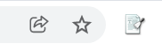

## Setup Instructions
In order to follow this lesson, you will need to make sure the following software is installed on your computer.
We will be using the Scraper Chrome extensiona and Python through [Anaconda](https://www.anaconda.com/products/distribution). After installing Anaconda, you will need to install `Scrapy` through the command line either by pip install
or conda forge. `Scrapy` is an open source framework for extracting data from websites.

## Scraper Chrome Extension

For the first half of the lesson, we will use a Chrome browser extension to get started with web scraping. Follow the steps below to install Scraper:

1. Make sure to have the Chrome browser installed in your computer. Follow the steps on [this website](https://chromeenterprise.google/browser/download/?utm_source=adwords&utm_medium=cpc&utm_campaign=2022-H1-chromebrowser-paidmed-paiddisplay-other-chromebrowserent&utm_term=downloadnow-chrome-browser-download&utm_content=GCEJ&brand=GCEJ&gclid=CjwKCAjw9qiTBhBbEiwAp-GE0U3sZqNSBoMSkTrxi2fMdK3Xajoq7KFOuEsMfa9o2KnE5vXBnzLovBoCP1IQAvD_BwE&gclsrc=aw.ds#windows-tab) and choose your OS if you need to install it.

2. Open [Chrome Web Store](https://chrome.google.com/webstore/category/extensions)

3. Search for “Scraper” in extensions and it should be the first one listed. Alternatively, you may or click on this link [Scraper extension](https://chrome.google.com/webstore/detail/scraper/mbigbapnjcgaffohmbkdlecaccepngjd).

4. Click the "add to" chrome button.

You will see a putty knife icon along your browser like so



### Using the Command line with Python using Anaconda and Scrapy

The second part of the lesson requires the Python programming language and access to a command-line interface (shell) on your computer.  If applicable: please **log out** of any drives on your device before installing the software. (e.g. OneDrive, BoxDrop, etc.)

> ## Prerequisites
> This part of the lesson requires some prior knowledge of Python and how to use a shell.
> If you need help getting started on those topics, we suggest going through the following
> lessons first (during a workshop or on your own):
>
> * [The Unix Shell](http://swcarpentry.github.io/shell-novice/)
> * [Programming with Python](http://swcarpentry.github.io/python-novice-inflammation/)
>
{: .prereq}

## Unix Shell: Install software
If you do not already have the shell software installed, you will need to
[download and install][install_shell] it.

#### Open a new shell
After installing the software
3. Open a terminal.
   If you're not sure how to open a terminal on your operating system, see the instructions below.
4. In the terminal type `cd` then press the <kbd>Return</kbd> key.
   This step will make sure you start with your home folder as your working directory.

In the lesson, you will find out how to access the data files in this folder.

> ## Where to type commands: How to open a new shell
>
> The shell is a program that enables us to send commands to the computer and receive output.
> It is also referred to as the terminal or command line.
>
> Some computers include a default Unix Shell program.
> The steps below describe some methods for identifying and opening
> a Unix Shell program if you already have one installed.
> There are also options for identifying and downloading a Unix Shell program,
> a Linux/UNIX emulator, or a program to access a Unix Shell on a server.
>
> If none of the options below address your circumstances,
> try an online search for: Unix shell [your computer model] [your operating system].
{: .callout}

{::options parse_block_html="true" /}
<div>
<ul class="nav nav-tabs nav-justified" role="tablist">
<li role="presentation" class="active"><a data-os="windows" href="#windows" aria-controls="Windows"
role="tab" data-toggle="tab">Windows</a></li>
<li role="presentation"><a data-os="macos" href="#macos" aria-controls="macOS" role="tab"
data-toggle="tab">macOS</a></li>
<li role="presentation"><a data-os="linux" href="#linux" aria-controls="Linux" role="tab"
data-toggle="tab">Linux</a></li>
</ul>

<div class="tab-content">
<article role="tabpanel" class="tab-pane active" id="windows">
Computers with Windows operating systems do not automatically have a Unix Shell program
installed.
In this lesson, we encourage you to use an emulator included in [Git for Windows][install_shell],
which gives you access to both Bash shell commands and Git.

Once installed, you can open a terminal by running the program Git Bash from the Windows start
menu.

**For advanced users:**

As an alternative to Git for Windows you may wish to [Install the Windows Subsystem for Linux][wsl]
which gives access to a Bash shell command-line tool in Windows 10.

Please note that commands in the Windows Subsystem for Linux (WSL) may differ slightly
from those shown in the lesson or presented in the workshop.
</article>

<article role="tabpanel" class="tab-pane" id="macos">
For a Mac computer running macOS Mojave or earlier releases, the default Unix Shell is Bash.
For a Mac computer running macOS Catalina or later releases, the default Unix Shell is Zsh.
Your default shell is available via the Terminal program within your Utilities folder.

To open Terminal, try one or both of the following:
* In Finder, select the Go menu, then select Utilities.
  Locate Terminal in the Utilities folder and open it.
* Use the Mac 'Spotlight' computer search function.
  Search for: `Terminal` and press <kbd>Return</kbd>.

To check if your machine is set up to use something other than Bash,
type `echo $SHELL` in your terminal window.

If your machine is set up to use something other than Bash,
you can run it by opening a terminal and typing `bash`.

[How to Use Terminal on a Mac][mac-terminal]
</article>

<article role="tabpanel" class="tab-pane" id="linux">
The default Unix Shell for Linux operating systems is usually Bash.
On most versions of Linux, it is accessible by running the
[Gnome Terminal][gnome-terminal] or [KDE Konsole][kde-konsole] or [xterm][xterm],
which can be found via the applications menu or the search bar.
If your machine is set up to use something other than Bash,
you can run it by opening a terminal and typing `bash`.
</article>
</div>
</div>

[zip-file]: {{ page.root }}/data/shell-lesson-data.zip
[wsl]: https://docs.microsoft.com/en-us/windows/wsl/install-win10
[mac-terminal]: http://www.macworld.co.uk/feature/mac-software/how-use-terminal-on-mac-3608274/
[gnome-terminal]: https://help.gnome.org/users/gnome-terminal/stable/
[kde-konsole]: https://konsole.kde.org/
[xterm]: https://en.wikipedia.org/wiki/Xterm
[install_shell]: https://carpentries.github.io/workshop-template/#shell

> ## Installing Python using Anaconda
>
> [Python][python] is a popular language for scientific computing, and great for
> general-purpose programming as well. Installing all of the scientific packages we use in the lesson
> individually can be a bit cumbersome, and therefore recommend the all-in-one
> installer [Anaconda][anaconda].
>
> Regardless of how you choose to install it, please make sure you install **Python
> version 3.x.**
>
>
{: .prereq}


## Installing Anaconda

{::options parse_block_html="true" /}
<div>
<ul class="nav nav-tabs" role="tablist">
  <li role="presentation" class="active"><a data-os="windows" href="#anaconda-windows" aria-controls="Windows" role="tab" data-toggle="tab">Windows</a></li>
  <li role="presentation"><a data-os="macos" href="#anaconda-macos" aria-controls="MacOS" role="tab" data-toggle="tab">MacOS</a></li>
  <li role="presentation"><a data-os="linux" href="#anaconda-linux" aria-controls="Linux" role="tab" data-toggle="tab">Linux</a></li>
</ul>

<div class="tab-content">
<article role="tabpanel" class="tab-pane active" id="anaconda-windows">

1.  Open <https://www.anaconda.com/products/individual> in your web browser.
2.  Download the Anaconda Python 3 installer for Windows.
3.  Double-click the executable and install Python 3 using the recommended settings.
    Make sure that **Register Anaconda as my default Python 3.x** option is checked --
    it should be in the latest version of Anaconda.
4.  Verify the installation:
    click Start, search and select `Anaconda Prompt` from the menu.
    A window should pop up where you can now type commands
    such as checking your Conda installation with:

    ~~~
    conda --help
    ~~~
    {: .language-bash}

#### Video Tutorial

<div class="yt-wrapper2">
<div class="yt-wrapper">
<iframe type="text/html" frameborder="0" allow="accelerometer; autoplay; encrypted-media; gyroscope; picture-in-picture" src="https://www.youtube-nocookie.com/embed/xxQ0mzZ8UvA?modestbranding=1&playsinline=1&iv_load_policy=3&rel=0" class="yt-frame" allowfullscreen></iframe>
</div>
</div>
</article>

<article role="tabpanel" class="tab-pane" id="anaconda-macos">

1.  Visit <https://www.anaconda.com/products/individual> in your web browser.
2.  Download the Anaconda Python 3 installer for macOS.
    These instructions assume that you use the graphical installer `.pkg` file.
3.  Follow the Anaconda Python 3 installation instructions.
    Make sure that the install location is set to "Install only for me"
    so Anaconda will install its files locally, relative to your home directory.
    Installing the software for all users tends to create problems in the long run
    and should be avoided.
4.  Verify the installation:
    click the Launchpad icon in the Dock, type Terminal in the search field, then click Terminal.
    A window should pop up where you can now type commands
    such as checking your conda installation with:

    ~~~
    conda --help
    ~~~
    {: .language-bash}

#### Video Tutorial

<div class="yt-wrapper2">
<div class="yt-wrapper">
<iframe type="text/html" frameborder="0" allow="accelerometer; autoplay; encrypted-media; gyroscope; picture-in-picture" src="https://www.youtube-nocookie.com/embed/TcSAln46u9U?modestbranding=1&playsinline=1&iv_load_policy=3&rel=0" class="yt-frame" allowfullscreen></iframe>
</div>
</div>
</article>

<article role="tabpanel" class="tab-pane" id="anaconda-linux">
Note that the following installation steps require you to work from the terminal (shell).
If you run into any difficulties, please request help before the workshop begins.

1.  Open <https://www.anaconda.com/products/individual> in your web browser.
2.  Download the Anaconda Python 3 installer for Linux.
3.  Install Anaconda using all of the defaults for installation.
    * Open a terminal window.
    * Navigate to the folder where you downloaded the installer.
    * Type `bash Anaconda3-` and press <kbd>Tab</kbd>.
      The name of the file you just downloaded should appear.
    * Press <kbd>Return</kbd>
    * Follow the text-only prompts.  When the license agreement appears (a colon
      will be present at the bottom of the screen) press <kbd>Spacebar</kbd> until you see the
      bottom of the text. Type `yes` and press <kbd>Return</kbd> to approve the license. Press
      <kbd>Return</kbd> again to approve the default location for the files. Type `yes` and
      press <kbd>Return</kbd> to prepend Anaconda to your `PATH` (this makes the Anaconda
      distribution your user's default Python).
4.  Verify the installation:
    this depends a bit on your Linux distribution, but often you will have an Applications listing
    in which you can select a Terminal icon you can click. A window should pop up where you can now
    type commands such as checking your conda installation with:

    ~~~
    conda --help
    ~~~
    {: .language-bash}

</article>
</div>
</div>

[anaconda]: https://www.anaconda.com/
[jupyter]: https://jupyter.org/
[python]: https://www.python.org/

<br/>

## Scrapy

Once you have a working installation of Python, the next step is to install [Scrapy](https://scrapy.org/).

If you have installed Python using the Anaconda framework as suggested by the Software Carpentry setup instructions,
you can easilly install Scrapy by doing the following:

1. Open a new shell (e.g. Terminal on Mac, or the Anaconda command-line tool on Windows)
2. Type the following:

```
 conda install -c conda-forge scrapy
```

Alternatively, if you have another distribution of Python, you can try using pip:

```
 pip install Scrapy
```

If you run into issues while installing Scrapy, refer to the
[official Scrapy install guide](https://doc.scrapy.org/en/latest/intro/install.html#intro-install)
or get in touch with your lesson instructor.
